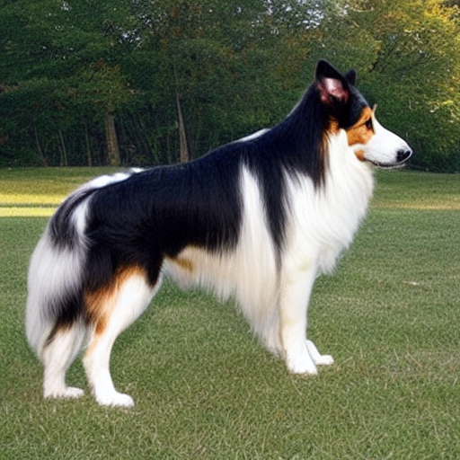

# sd15_vae-f8c32

"normal" sd and sdxl vae, can bbe described as "f8c4".
8x scale, 4 channel.

latest vaes like flux2, are 32 channel.

What happens if we put a 32channel vae on sd1.5? Let's find out!

This experiment will go through multiple steps.
Step 1: Modify the sd1.5 model, and vae, so they have 32 channels instead
of just 4. Can we make it work and preserve the knowledge?
(by leaving the new extra channels zeroed)?

Answer: YES!

Run create_sd_intermediate.py to automatically pull in the old
model, and transmogrify it.
Test it with test_intermediate.py

You will get something like the included sample image:

# Training it properly

UNFORTUNATELY... the above will give you something that technically has 32 channels... but only uses 4 of them, because the rest are zero'd.
That means you cant even train it!

To make it better, you need to run `prep_intermediate.py` on it.
THEN you can train the vae further.

The most annoying part is that I havent learned enough about vae training to maximize the output of this new vae.
Additionally, if you do manage to train up the vae to its full potential, keep in mind that you will then need to also train the main model here to match up with it properly.

